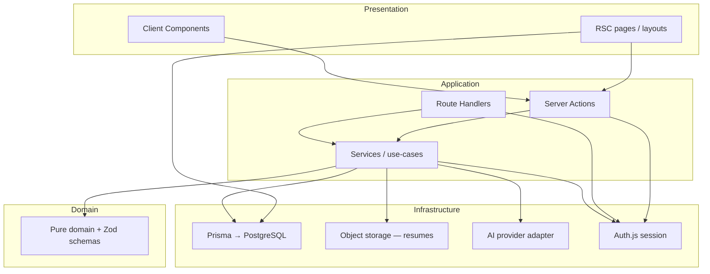
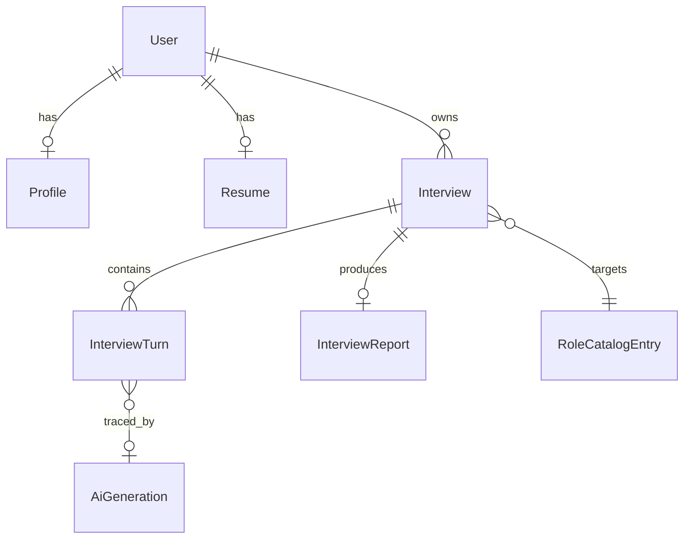
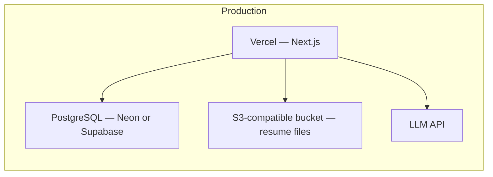

# Architecture Spine — AI Interview Preparation Platform

## Design Paradigm

**Layered modular monolith** on Next.js App Router: one deployable unit, strict dependency direction, domain logic isolated from UI and infrastructure.



| Layer | Location | May depend on |
| --- | --- | --- |
| Presentation | `src/app/**`, `src/components/**` | Application (via Server Actions), never Prisma/AI directly |
| Application | `src/server/actions/**`, `src/app/api/**`, `src/server/services/**` | Domain, Infrastructure |
| Domain | `src/lib/domain/**`, `src/lib/validation/**` | Nothing outward |
| Infrastructure | `src/lib/db/**`, `src/lib/ai/**`, `src/lib/storage/**`, `src/lib/auth/**` | Domain types/schemas only |

## Invariants & Rules

### AD-1 — Server-only persistence and AI

- **Binds:** all features
- **Prevents:** Client Components calling Prisma, leaking DB credentials, or invoking LLM APIs from the browser
- **Rule:** `@prisma/client` and AI provider SDKs import only from `src/lib/db`, `src/lib/ai`, or `src/server/**`. Client bundles must not include them.

### AD-2 — User tenancy on every private read/write

- **Binds:** F-02–F-11, FR-4, FR-12, FR-36–FR-42
- **Prevents:** Cross-user data access via guessed IDs
- **Rule:** After session resolution, every Prisma query for User-owned entities includes `where: { userId: session.user.id }` (or equivalent join). Missing row → HTTP 404, not 403. No admin bypass in MVP.

### AD-3 — Session gate on all mutations and private reads

- **Binds:** F-01, all Server Actions and Route Handlers touching private data
- **Prevents:** Unauthenticated mutations and “hidden route” security
- **Rule:** Shared `requireSession()` (or Auth.js wrapper) runs at the start of each Server Action and private Route Handler; unauthenticated → 401.

### AD-4 — Zod at system boundaries

- **Binds:** all FRs with external input; F-03, F-05, F-06, F-08, F-09
- **Prevents:** Unvalidated uploads, config, answers, or AI JSON entering persistence
- **Rule:** Validate Client/Handler input with Zod before services. Validate AI output with dedicated Zod schemas before any write of scores, report bodies, or question text.

### AD-5 — AI provider abstraction

- **Binds:** F-07, F-08, F-09
- **Prevents:** Provider-specific calls scattered in services; untestable AI coupling
- **Rule:** Services call `src/lib/ai/client` interface only (`generateStructured`, `generateText`). One adapter module per vendor; env selects active adapter.

### AD-6 — Prompt identity on every generation

- **Binds:** F-07, F-08, F-09
- **Prevents:** Non-reproducible feedback and untraceable regressions
- **Rule:** Each LLM call records `promptId`, `promptVersion`, `modelId` on the persisted `AiGeneration` row (or embedded metadata on Question/Evaluation/Report). Prompts live in `src/lib/ai/prompts/` with semver versions.

### AD-7 — No trusted model output

- **Binds:** F-08, F-09, PG-2
- **Prevents:** Hallucinated scores or report sections stored as truth
- **Rule:** On schema validation failure: one repair retry, then mark Interview `report_failed` / `completed_pending_report` and surface safe UI; never persist partial rubric scores without passing schema.

### AD-8 — Interview lifecycle state machine

- **Binds:** F-06, F-08, F-09, F-10
- **Prevents:** Double completion, answers after complete, ambiguous report triggers
- **Rule:** Interview `status` is one of: `in_progress`, `completed`, `ended_early`, `completed_pending_report`, `report_failed`, `abandoned`. Answers accepted only in `in_progress`. Report generation runs only from terminal interview states defined in domain module.

### AD-9 — Resume file vs Resume Summary

- **Binds:** F-03, F-07, security
- **Prevents:** Storing binaries in Postgres; AI reading unedited corrupt parse
- **Rule:** Original file in object storage (private key per user); `ResumeSummary` text in PostgreSQL (user-editable). AI grounding uses Summary only. Upload path validates type (PDF/DOCX) and size (≤5 MB) before storage.

### AD-10 — Auth provider singularity [ADOPTED]

- **Binds:** F-01
- **Prevents:** Mixed Clerk + Auth.js patterns in one deployment
- **Rule:** MVP implements **Auth.js (NextAuth v5)** with Prisma adapter. Clerk remains a swap only via a future AD amendment, not concurrent use.

### AD-11 — Server Actions vs Route Handlers split

- **Binds:** presentation + application layers
- **Prevents:** Ad hoc REST for every form; missing upload/stream endpoints
- **Rule:** Form mutations and interview turns use **Server Actions**. **Route Handlers** for resume upload (multipart), AI endpoints that need explicit rate-limit middleware, and health checks. No public GraphQL.

### AD-12 — Rate limiting on AI-facing HTTP entrypoints

- **Binds:** F-07, F-08, F-09, project-context Security
- **Prevents:** Cost blowups and abuse of LLM routes
- **Rule:** Route Handlers (and Server Actions that invoke LLM) enforce per-`userId` limits via shared middleware/helper; return 429 with retry-after. Log rate-limit events without answer/resume content.

## Consistency Conventions

| Concern | Convention |
| --- | --- |
| Naming (entities, files, interfaces, events) | DB/Prisma: `PascalCase` models, `camelCase` fields, `userId` FK. Files: kebab-case routes, `*.schema.ts` for Zod. Analytics: `snake_case` event names per PRD addendum. |
| Data & formats (ids, dates, error shapes, envelopes) | IDs: UUID v4. Timestamps: UTC `DateTime` in DB, ISO 8601 in JSON. API errors: `{ error: { code: string, message: string, field?: string } }`. Rubric scores: integers 1–5. |
| State & cross-cutting (mutation, errors, logging, config, auth) | Env validated once via Zod in `src/lib/env.ts`. Logs: structured JSON; include `userId`, `interviewId`, never full resume/transcript. Config: role catalog seeded in DB or const module — single source for `role_id`. |

## Stack

| Name | Version |
| --- | --- |
| Node.js | 20 LTS |
| TypeScript | 5.x |
| Next.js | 16.2.12 |
| React | 19.2.4 |
| Tailwind CSS | 4.x |
| PostgreSQL | 15+ |
| Prisma | 6.x |
| Zod | 3.x |
| Auth.js (next-auth) | 5.x |
| Playwright | 1.x |

## Structural Seed



```text
src/
  app/                    # App Router: RSC pages, loading/error boundaries
    (auth)/               # sign-in/up
    (app)/                # authenticated shell
      dashboard/
      interview/[id]/
      history/
      profile/
    api/                  # Route Handlers: upload, AI (rate-limited)
  components/             # UI; Client only when needed
  lib/
    auth/                 # Auth.js config, requireSession
    db/                   # Prisma singleton
    domain/               # Interview state machine, rubric, config enums
    validation/           # Zod schemas (input + AI output)
    ai/
      prompts/            # versioned prompt templates
      providers/          # vendor adapters
      client.ts           # AD-5 facade
    storage/              # resume object storage adapter
  server/
    actions/              # Server Actions by domain
    services/             # use-cases orchestrating db + ai + storage
prisma/
  schema.prisma
  migrations/
```



## Capability → Architecture Map

| Capability | Lives in | Governed by |
| --- | --- | --- |
| F-01 Authentication | `src/lib/auth`, `src/app/(auth)/**` | AD-3, AD-10 |
| F-02 User Profile | `src/server/services/profile`, `src/server/actions/profile` | AD-2, AD-3, AD-4 |
| F-03 Resume Upload | `src/app/api/resume`, `src/lib/storage`, `src/server/services/resume` | AD-4, AD-9, AD-11 |
| F-04 Job Role Selection | `src/lib/domain/roles`, seed/migration | AD-4 |
| F-05 Interview Configuration | `src/server/services/interview-config` | AD-4, AD-8 |
| F-06 Text Mock Interview | `src/app/(app)/interview/**`, `src/server/actions/interview` | AD-1, AD-8, AD-11 |
| F-07 AI Questions | `src/lib/ai`, `src/server/services/question` | AD-5, AD-6, AD-7, AD-12 |
| F-08 AI Evaluation | `src/server/services/evaluation` | AD-4, AD-5, AD-6, AD-7 |
| F-09 Interview Report | `src/server/services/report`, RSC report page | AD-4, AD-7, AD-8 |
| F-10 Interview History | `src/app/(app)/history/**`, services | AD-2 |
| F-11 Progress Dashboard | `src/app/(app)/dashboard/**`, aggregate queries | AD-2, domain rubric mean |

## Deferred

| Topic | Reason |
| --- | --- |
| Background job queue (Inngest/BullMQ) for report generation | MVP allows synchronous or `waitUntil` on Vercel; revisit if p95 report latency exceeds PRD NFR |
| Exact object storage vendor (R2 vs S3 vs Supabase Storage) | AD-9 fixes pattern; adapter choice at first implement |
| Rate-limit backend (Upstash vs edge memory) | AD-12 requires limits; store choice when wiring production |
| Clerk swap for Auth.js | AD-10 locks Auth.js for MVP |
| Multi-region / read replicas | Single-region Postgres sufficient for solo MVP |
| Analytics vendor (PostHog etc.) | PRD allows DB + logs first |
| Fallback static question bank storage | PRD addendum; implement as seeded `FallbackQuestion` table when building F-07 resilience |
