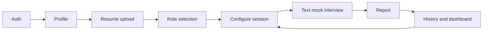

# Addendum: AI Interview Preparation Platform

Supplement to the product brief. Detail that supports PRD and solution design without bloating the executive brief.

## MVP capability matrix

| Capability | MVP intent | Notes for PRD |
|------------|------------|---------------|
| Authentication | Individual sign-up/sign-in | Prefer managed provider (OAuth or magic link); no custom password storage |
| User profile | Name, email, target role defaults | Minimal fields; expand later |
| Resume upload | PDF/DOCX → stored file + extracted text | User-editable summary if parse fails |
| Job-role selection | Constrained taxonomy (dropdown) | Start with 5–8 SWE-oriented roles |
| Interview configuration | Pre-session settings | e.g., duration cap, question count, behavioral/technical mix |
| Text mock interview | Turn-based chat UI | No voice/video; session state persisted |
| AI-generated questions | Role + resume + config grounded | Follow-ups on vague answers |
| AI evaluation | Rubric-based scoring + narrative | Structured JSON → report template |
| Interview report | Post-session artifact | Scores, strengths, gaps, suggested rewrites |
| Interview history | List + detail per session | Link to report and transcript |
| Basic progress dashboard | Aggregates over history | Session count, average scores, recurring weak tags |

## User journey (MVP)

## Postponed capabilities (aligned with brief exclusions)

| Capability | Rationale |
|------------|-----------|
| Live video | AV, cost, moderation, latency |
| Human interviewers | Matching, scheduling, quality control |
| Real-time voice | STT/TTS cost and UX complexity |
| Native mobile | Responsive web first |
| Team / enterprise | Different buyer, SSO, compliance |
| Payments | Validate retention and unit economics first |

Additional candidates for post-MVP (not requested as exclusions but natural sequels): company-specific packs, live coding IDE, system design whiteboard, peer mocks, B2B bootcamp licenses.

## Risks (product and technical)

**Product**

- Generic feedback → mitigate with resume citations and fixed rubric dimensions.
- Low return usage → short sessions, email recap, visible progress on dashboard.
- Commodity vs. raw ChatGPT → moat is workflow, history, and consistent measurement.

**Technical**

- LLM cost → session caps, token limits, cached resume summary.
- Resume PII → encryption, deletion on request, clear privacy policy.
- Hallucination about user background → ground only in parsed/edited resume; disclaimers on report.
- Prompt injection via resume → sanitize and isolate resume content in prompts.

## Monetization (post-MVP options)

Not in MVP scope. Likely directions after retention proof: freemium session limits, monthly subscription, or credit packs. Bootcamp/university licenses later.

## Solo-developer delivery hints

- Stack aligned with repo: Next.js, Postgres, object storage for resumes, one LLM API with structured outputs.
- Defer background workers unless report generation exceeds acceptable latency; synchronous generation with loading UI is acceptable for MVP.

## Rejected or deferred alternatives

- **Video-first mock:** excluded by product decision for MVP.
- **Payments at launch:** excluded; avoids support burden before product-market signal.
- **Broad role catalog at launch:** risks shallow question quality; prefer narrow taxonomy first [ASSUMPTION].
